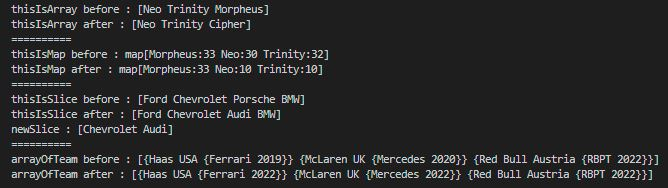

TASK - buat satu deklarasi (inisialisasi) variable map, struct, slice, array & assign type data yang tadi menjadi data yang baru

package main

import "fmt"

func main() {
//Array
thisIsArray := [3]string{"Neo", "Trinity", "Morpheus"}
fmt.Println("thisIsArray before :", thisIsArray)
thisIsArray[2] = "Cipher"
fmt.Println("thisIsArray after :", thisIsArray)

    fmt.Println("==========")

    //Map
    thisIsMap := map[string]int{
    	"Neo" : 30,
    	"Trinity" : 32,
    	"Morpheus" : 33,
    }
    fmt.Println("thisIsMap before :", thisIsMap)
    for i, v := range thisIsMap {
    	if(v < 33){
    		thisIsMap[i] = 10
    	}
    }
    fmt.Println("thisIsMap after :", thisIsMap)

    fmt.Println("==========")

    //Slice
    thisIsSlice := []string{"Ford", "Chevrolet", "Porsche", "BMW"}
    fmt.Println("thisIsSlice before :", thisIsSlice)
    for i, value := range thisIsSlice {
    	if(value == "Porsche"){
    		thisIsSlice[i] = "Audi"
    	}
    }
    fmt.Println("thisIsSlice after :", thisIsSlice)
    newSlice := thisIsSlice[1:3]
    fmt.Println("newSlice :", newSlice)

    fmt.Println("==========")

    //Struct
    var haas team = team{"Haas", "USA", engine{"Ferrari", 2019}}
    var mclaren team = team{"McLaren", "UK", engine{"Mercedes", 2020}}
    var redbull team = team{"Red Bull", "Austria", engine{"RBPT", 2022}}
    arrayOfTeam := [...]team{haas, mclaren, redbull}
    fmt.Println("arrayOfTeam before :", arrayOfTeam)
    for i := 0; i < len(arrayOfTeam); i++ {
    	if(arrayOfTeam[i].engine.year < 2022){
    		arrayOfTeam[i].engine.year = 2022
    	}
    }
    fmt.Println("arrayOfTeam after :", arrayOfTeam)

}

//Struct
type team struct{
name string
origin string
engine engine
}

type engine struct{
brand string
year int
}

console.log -->

